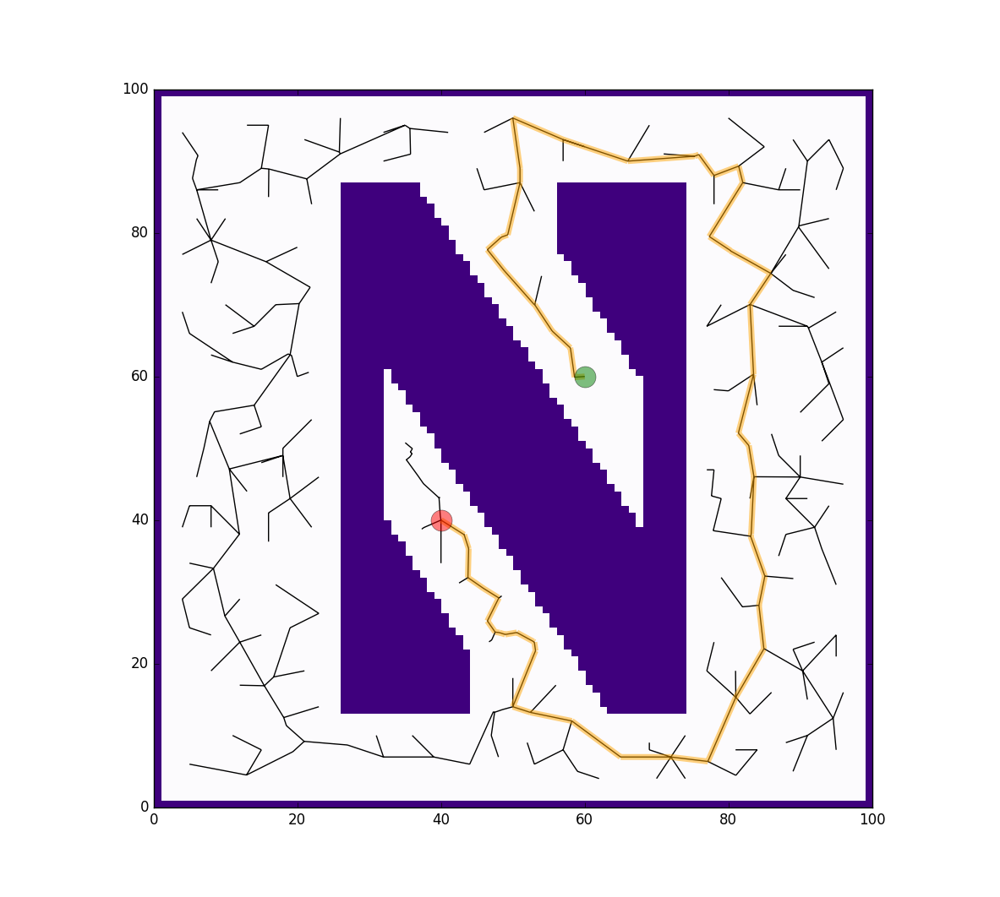

# Rapidly-exploring Random Tree (RRT)

This repo implements RRT planning algorithm on a Northwestern logo maze.

It takes in a bit map of the Northwestern logo, and plans a route from start (red dot) to end (green dot).

